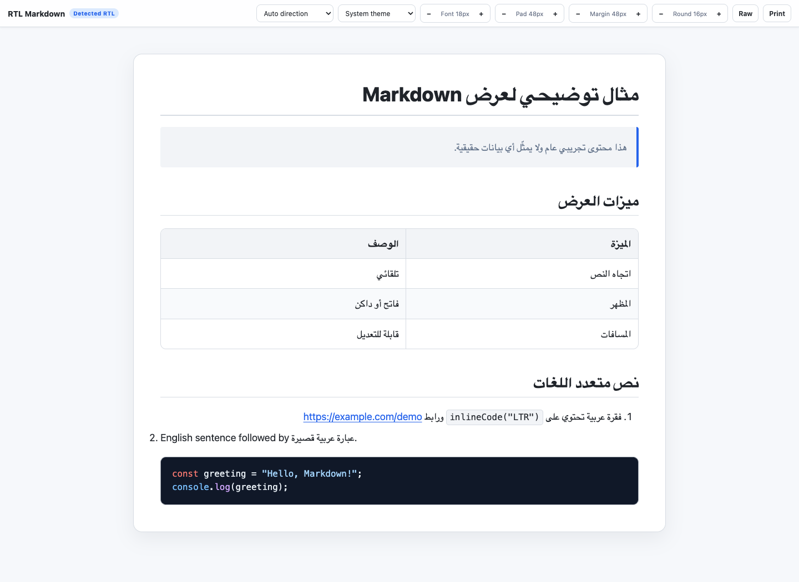

# RTL Markdown Viewer

A privacy-first, local Chrome extension for reading Markdown files with correct
Arabic, Hebrew, and mixed RTL/LTR layout.

[Source code](https://github.com/SalehHub/rtl-markdown-viewer) ·
[Report an issue](https://github.com/SalehHub/rtl-markdown-viewer/issues) ·
[Privacy policy](https://github.com/SalehHub/rtl-markdown-viewer/blob/main/PRIVACY.md)

## What it fixes

- Arabic-dominant documents automatically use a right-to-left page layout.
- The first Markdown table column appears on the right in RTL documents.
- Headings, paragraphs, lists, quotes, and individual table cells detect their
  own writing direction in Auto mode.
- Code blocks, inline code, identifiers, and URLs remain left-to-right.
- Explicit RTL and LTR modes are available from both the page toolbar and the
  extension popup.
- Font size, page padding, page margin, and rounded corners can all be adjusted.
  Padding, margin, and rounded corners support `0px` for a flush, square layout.
- Light, dark, and system themes are included.
- Printing and Save as PDF preserve the selected direction and layout spacing.

## Install in Chrome

1. Disable any other extension that automatically renders local
   Markdown files. Two viewers should not control the same page.
2. Open `chrome://extensions`.
3. Turn on **Developer mode**.
4. Click **Load unpacked**.
5. Select this `rtl-markdown-viewer` folder.
6. Open the extension’s **Details** page and enable
   **Allow access to file URLs**.
7. Reopen or reload a local `.md` file.

## Verify RTL rendering

Open `sample/arabic-sample.md`. The page should show **Detected RTL**. In the
first table, **الميزة** must be the rightmost column and **الوصف** the leftmost
column. The JavaScript block must remain left-aligned and left-to-right.

## Privacy

The extension reads only local file URLs that Chrome permits it to access. It
does not upload files to the developer, collect analytics, or require an
account. Settings are saved with Chrome’s built-in synchronized storage.
Remote images or other media embedded in a document may be fetched by Chrome
from their original hosts. Followed external links open their destination sites.

See the complete [Privacy Policy](PRIVACY.md).

## Chrome Web Store release

Submission copy, reviewer instructions, and correctly sized listing artwork are
available in [`store-assets`](store-assets/). Run `npm run package` to create a
versioned upload ZIP and SHA-256 checksum in `dist/`. Packaging requires a Git
checkout and includes only tracked extension files. The checksum contains only
the archive filename, without a local filesystem path.

## Development

Node.js 22 or later is recommended. No npm dependencies need to be installed.

Run `npm run check` to check JavaScript syntax and run the test suite.
Run `node tests/integration-server.js` for a local preview at the URL it prints.

## Support

Report bugs and ask questions in the repository's **Issues** tab. Use the
generic sample to reproduce problems; remove personal or confidential content
from reports and screenshots before sharing them.

## Included libraries

- marked 18.0.11
- DOMPurify 3.4.14
- highlight.js 11.12.0

Their license texts are included in `vendor/licenses/`.
